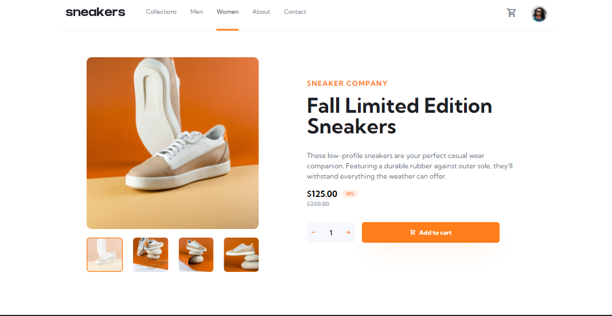

# Frontend Mentor - E-commerce product page solution

This is a solution to the [E-commerce product page challenge on Frontend Mentor](https://www.frontendmentor.io/challenges/ecommerce-product-page-UPsZ9MJp6). Frontend Mentor challenges help you improve your coding skills by building realistic projects.

## Table of contents

- [Overview](#overview)
  - [The challenge](#the-challenge)
  - [Screenshot](#screenshot)
  - [Links](#links)
- [My process](#my-process)
  - [Built with](#built-with)
  - [Useful resources](#useful-resources)
- [Getting Started](#Getting-Started)
- [Author](#author)

## Overview

### The challenge

Users should be able to:

- View the optimal layout for the site depending on their device's screen size
- See hover states for all interactive elements on the page
- Open a lightbox gallery by clicking on the large product image
- Switch the large product image by clicking on the small thumbnail images
- Add items to the cart
- View the cart and remove items from it

### Screenshot

### Links

- Solution URL: [Add solution URL here](https://your-solution-url.com)
- Live Site URL: [Add live site URL here](https://your-live-site-url.com)

## My process

### Built with

- [React](https://reactjs.org/) - JS library
- [TypeScript](https://www.typescriptlang.org/) - TypeScript
- [Redux]() - State Management
- [React-Redux]() - State Management
- [tailwind CSS](https://tailwindcss.com/) - For Styles

### Useful resources

- [React With TypeScript Best Practices](https://www.sitepoint.com/react-with-typescript-best-practices/) - This is an amazing article which helped me finally understand using react and typeScript. I'd recommend it to anyone still learning this concept.
- [React with TypeScript cheatsheet](https://github.com/typescript-cheatsheets/react) - This helped me for using react and typescript. I really liked this pattern and will use it going forward.
- [Tailwind CSS Documentation](https://tailwindcss.com/) - This helped me a lot using tailwind css. A very good documentation

## Getting Started

$ git clone https://github.com/Moro-Afriyie/E-commerce-product-page.git or you can download the zip file

    $ cd e-commerce-product-page

    $ npm install

    $ npm start

This project was bootstrapped with [Create React App](https://github.com/facebook/create-react-app).

## Available Scripts

In the project directory, you can run:

### `npm start`

Runs the app in the development mode.\
Open [http://localhost:3000](http://localhost:3000) to view it in the browser.

The page will reload if you make edits.\
You will also see any lint errors in the console.

### `npm test`

Launches the test runner in the interactive watch mode.\
See the section about [running tests](https://facebook.github.io/create-react-app/docs/running-tests) for more information.

### `npm run build`

Builds the app for production to the `build` folder.\
It correctly bundles React in production mode and optimizes the build for the best performance.

The build is minified and the filenames include the hashes.\
Your app is ready to be deployed!

See the section about [deployment](https://facebook.github.io/create-react-app/docs/deployment) for more information.

## Author

- Website - [Moro Owusu Afriyie]()
- Frontend Mentor - [@Moro-Afriyie](https://www.frontendmentor.io/profile/Moro-Afriyie)
- Twitter - [@NkatieBorga](https://twitter.com/NkatieBorga)
